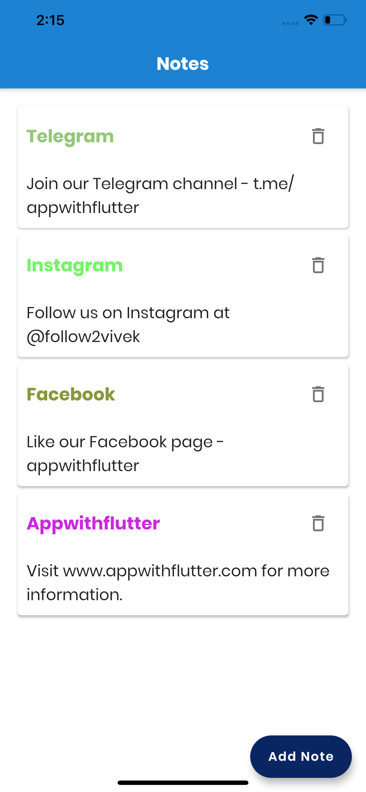

## Detail explanation available at => https://www.appwithflutter.com/flutter-database-note-app-sqflite/

## Follow Us

<table>
  <tr>
    <td></td>
    <td><a href="https://www.instagram.com/appwithflutter/">@appwithflutter</a></td>
  </tr>
  <tr>
    <td></td>
    <td><a href="https://t.me/appwithflutter">t.me/appwithflutter</a></td>
  </tr>
  <tr>
    <td></td>
    <td><a href="https://www.facebook.com/appwithflutter/">appwithflutter</a></td>
  </tr>
</table>

ScreenShot | ScreenShot
------------ | -------------
 |  

